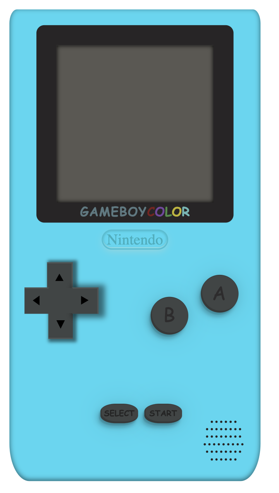
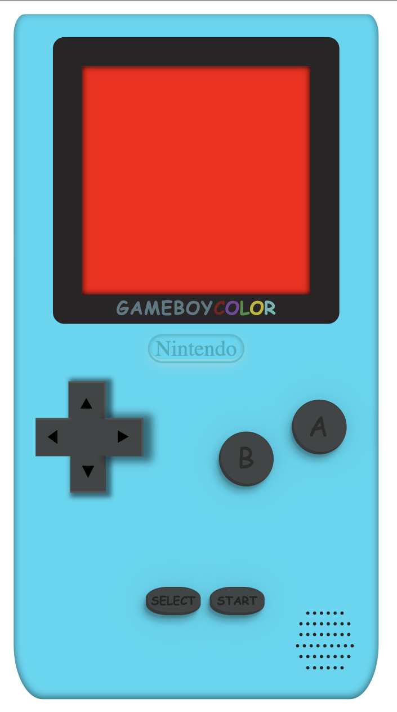

# My first HTML & CSS project

## Table of Contents

- [Introduction](#introduction)
- [Requirements & Usage](#requirements)
- [Built with](#builtwith)
- [Demo](#builtwith)
- [Screenshots](#screenshots)

## Introduction 

This is my first project using HTML, CSS and some JavaScript under the 'bootcamp'training of the Geekshubs Academy.

## Requirements & usage 

The only requirement is to have a code editor like "Visual Studio Code" for example.

To start using the app we just have to clik the 'start' button. We will see that the color of the button chages when passing over it with the cursor. When you press the button, the screen will appear in red because no more interactions have been added to it yet.

### Demo & screenshoots

To preview the demo <a href="https://leyreromero.github.io/gameboy-1/" > tap here </a>.

The screenshoots with and without pressing the bottom 'start'.

>
